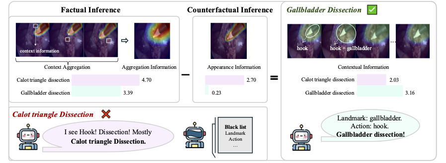
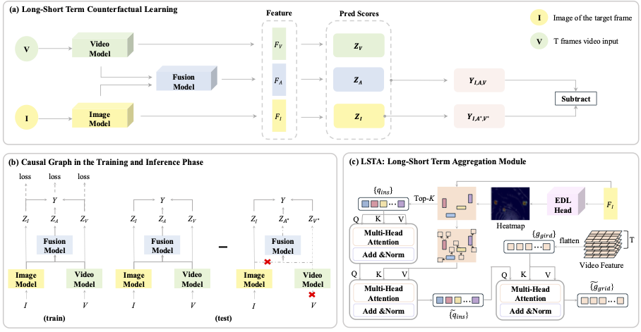

# LSTCL

## Introduction
<p align="center">
  
</p>

- Surgical phase recognition, a critical aspect of surgical work-
flow analysis, has received substantial attention due to its potential to
improve intraoperative decision-making and training. However, a signifi-
cant challenge in this field is the instrument-bias problem, where models
overly rely on the appearance of surgical instruments rather than the
actual surgical phase. To address this, we introduce a novel methodol-
ogy, Long-Short Term Counterfactual Learning (LSTCL), which aims to
disentangle instrument appearance from surgical phases. By leveraging
both short-term and long-term representations of surgical videos, LSTCL
incorporates a Long-Short Term Aggregation (LSTA) module to fuse
dynamic, keypoint-centric context with long-term video features. Addi-
tionally, a short-term debiasing mechanism mitigates the direct impact
of instrument appearance. Extensive experiments on two public datasets
demonstrate the superior performance of our method over state-of-the-
art methods as well as effectiveness of each component.
<p align="center">
  
</p>
## Installation
1. git clone this repo.
2. Create a virtual environment
```shell
> conda env create -f environment.yml
```
> * Environment: CUDA 12.1 / Python 3.8

## Data Preparation
We use the dataset [Cholec80](https://camma.unistra.fr/datasets/) and [AutoLaparo](https://autolaparo.github.io/).
1. Download raw videos.
2. Extract frames from videos at a rate of 1 frame per second.
```shell
> ffmpeg –i Your_Video_name.mp4 -vf fps=1 %d.png
```
3. Cut the black margin and resize frames.
```shell
> python cutmargin.py
```
> Please change source_path and save_path to your own directory.

4. Generate PKL
```shell
> python datasets/data_preprosses/generate_labels_ch80.py
> python datasets/data_preprosses/generate_labels_autolaparo.py
```

The final structure of data folder should be arranged as follows:
```
(root folder)
├── data
|  ├── cholec80
|  |  ├── cutMargin
|  |  |  ├── 1
|  |  |  ├── 2
|  |  |  ├── 3
|  |  |  ├── ......
|  |  |  ├── 80
|  |  ├── labels
|  |  |  |  ├── train
|  |  |  |  |  ├── 1pstrain.pickle
|  |  |  |  |  ├── ...
|  |  |  |  ├── test
|  |  |  |  |  ├── 1psval_test.pickle
|  |  |  |  |  ├── ...
|  ├── AutoLparo
      ......
```

## Pretrained Parameters
* [TimeSformer](https://github.com/facebookresearch/TimeSformer) trained on [K400 dataset](https://www.dropbox.com/s/g5t24we9gl5yk88/TimeSformer_divST_8x32_224_K400.pyth?dl=0) with frames 8 and spatial size 224 as initialization parameters.
* [VIT](https://github.com/google-research/vision_transformer) pre-trained on ImageNet-21k and fine-tuned on ImageNet with patchsize 16 and spatial size 224.

## Training and Testing
1. Training
```shell
sh train_phase_gpus_fusion.sh
```
> Please modify pretrained_path, pretrained_path_of_fusion, data_path, eval_data_path to your own directory and remind to change data_set when you want to use another dataset.
2. Testing
```shell
sh test_phase_gpus_fusion.sh
```
3. Use [Matlab Evaluation Code](https://github.com/isyangshu/Surgformer/tree/master/evaluation_matlab) to compute metrics.

## Acknowledgements
Really appreciate the author of following work:
- [Surgformer](https://github.com/isyangshu/Surgformer)
- [VIT](https://github.com/google-research/vision_transformer)
- [Transsvnet](https://github.com/xjgaocs/Trans-SVNet)
- [TMRNet](https://github.com/YuemingJin/TMRNet)
- [TimeSformer](https://github.com/facebookresearch/TimeSformer)
